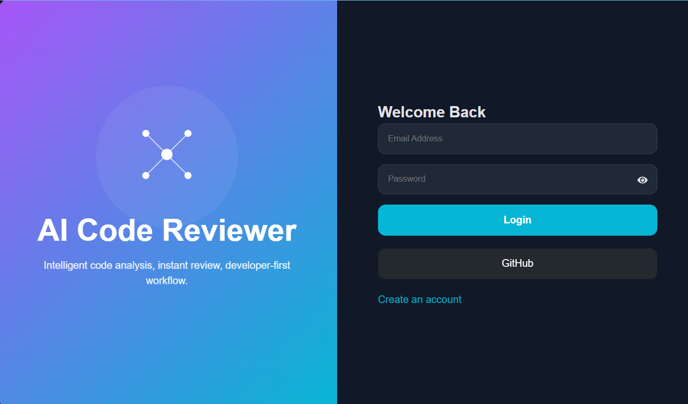
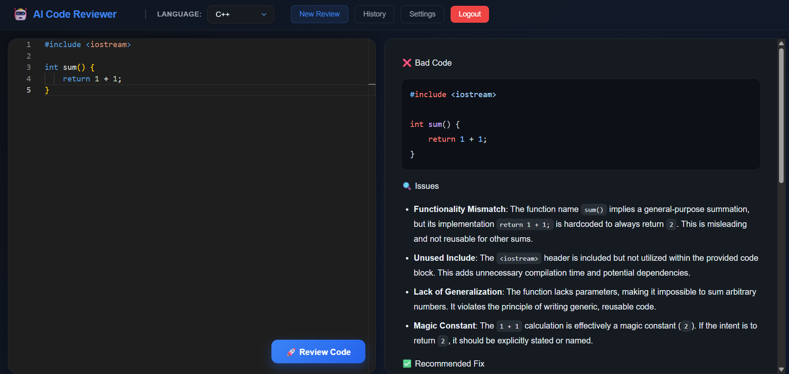
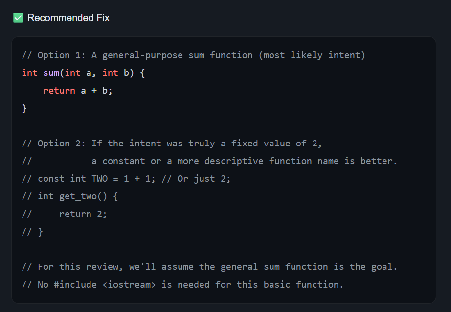

# 🤖 AI Code Reviewer


> An AI-powered code review platform built with **React**, **Node.js**, **Express**, and **Google Gemini 2.5 Flash** that provides intelligent code analysis, detects issues, recommends best practices, and generates improved code in a structured Markdown format.

---

## 📖 Overview

AI Code Reviewer is a full-stack web application that allows developers to paste or write code directly in a Monaco Editor and receive an AI-generated code review within seconds.

The application currently supports:

- JavaScript
- Python
- C++

The AI analyzes the submitted code and returns:

- ❌ Bad Code (if applicable)
- 🔍 Issues detected
- ✅ Recommended Fix
- 💡 Suggested Improvements

---

# 🌟 Key Highlights

- 🤖 AI-powered code reviews using **Google Gemini 2.5 Flash**
- 💻 Monaco Editor with syntax highlighting
- ⚡ Instant AI feedback in Markdown format
- 🌐 Supports JavaScript, Python, and C++
- 🎨 Modern glassmorphism user interface
- 📱 Responsive authentication page
- 🔄 Automatic retry mechanism for Gemini API rate limits
- 🏗️ Modular backend architecture (Routes → Controllers → Services)
- 📝 Clean, syntax-highlighted review output

# 📸 Screenshots

## Login Page



---

## Main Workspace



---

## AI Review Output



---

# ✨ Features

## ✅ Current Features

- AI-powered code review using Google Gemini
- Monaco Code Editor
- Syntax highlighting
- Markdown formatted AI responses
- Language selection
- Beautiful glassmorphism UI
- Responsive layout
- Login/Register UI
- Password visibility toggle
- Animated background
- Loading indicator during AI analysis
- Retry mechanism for Gemini API rate limiting

---

# 🛠️ Tech Stack

## Frontend

- React
- Vite
- Monaco Editor
- Axios
- React Markdown
- Rehype Highlight
- Highlight.js
- React Icons

---

## Backend

- Node.js
- Express.js
- Google Gemini API
- CORS

---

# 📂 Project Structure

```text
AI_CODE_REVIEWER/
│
├── backend/
│   ├── src/
│   │   ├── controllers/
│   │   │   └── ai.controller.js
│   │   │
│   │   ├── routes/
│   │   │   └── ai.routes.js
│   │   │
│   │   ├── services/
│   │   │   └── ai.service.js
│   │   │
│   │   └── app.js
│   │
│   ├── .env
│   ├── package.json
│   └── server.js
│
├── frontend/
│   ├── src/
│   │   ├── assets/
│   │   ├── pages/
│   │   │   ├── Auth.jsx
│   │   │   └── Auth.css
│   │   │
│   │   ├── App.jsx
│   │   ├── App.css
│   │   ├── main.jsx
│   │   └── index.css
│   │
│   ├── package.json
│   └── vite.config.js
│
├── README.md
└── .gitignore
```

---

# ⚙️ Installation

## 1. Clone the Repository

```bash
git clone https://github.com/your-username/AI-Code-Reviewer.git

cd AI-Code-Reviewer
```

---

## 2. Install Backend Dependencies

```bash
cd backend

npm install
```

---

## 3. Install Frontend Dependencies

```bash
cd ../frontend

npm install
```

---

# 🔑 Environment Variables

Inside the **backend** folder create a file named

```
.env
```

Add your Gemini API key

```env
google_gemini_key=YOUR_GEMINI_API_KEY
```

You can obtain an API key from:

https://aistudio.google.com/app/apikey

---

# ▶️ Running the Application

## Start Backend

Navigate to the backend directory:

```bash
cd backend
```

Start the backend server using **nodemon**:

```bash
npx nodemon server.js
```

The backend server will start on:

```
http://localhost:3000
```

> **Note:** If `nodemon` is not installed globally, `npx` will automatically use the local version (if installed) or download it temporarily.

---

## Start Frontend

```bash
cd frontend

npm run dev
```

Vite starts on

```
http://localhost:5173
```

---

Open

```
http://localhost:5173
```

in your browser.

---

# 🚀 How to Use

### Step 1

Open the application.

---

### Step 2

Login using any email in the format

```
name@domain.com
```

Example

```
john@example.com
```

Password must contain at least **6 characters**.

> **Note:** Authentication is currently client-side only and does not validate against a backend database.

---

### Step 3

Select a programming language.

Currently supported:

- JavaScript
- Python
- C++

---

### Step 4

Write or paste your code into the Monaco Editor.

---

### Step 5

Click

```
🚀 Review Code
```

The AI will analyze your code and generate:

- Issues
- Recommendations
- Improved code
- Best practices

---

# 📡 API Endpoint

### POST

```
/ai/get-review
```

Request Body

```json
{
  "code": "...",
  "language": "javascript"
}
```

Response

```markdown
AI generated markdown review
```

---

# ⚠️ Current Limitations

The following features are **UI only** and are **not implemented yet**.

## Navigation

- ❌ New Review
- ❌ History
- ❌ Settings

These buttons are placeholders and can be implemented in future versions.

---

## GitHub Login

The **GitHub** button is currently a placeholder.

GitHub OAuth authentication has **not** been implemented yet.

---

## Authentication

Current login is only for demonstration purposes.

Use any valid email format:

```
name@domain.com
```

Example

```
hemang@example.com
```

No backend authentication or database is used at the moment.

---

# 🔮 Future Improvements

Some ideas planned for future releases include:

- User authentication using JWT
- GitHub OAuth Login
- Code review history
- Save previous reviews
- User profiles
- Review analytics
- AI explanation mode
- Copy review button
- Download review as PDF
- Export Markdown report
- Multi-file project review
- Drag & Drop file upload
- Dark / Light theme
- Additional programming language support
- Docker support
- Deployment to cloud
- Review sharing via URL
- AI chat assistant for follow-up questions
- Code complexity analysis
- Security vulnerability scanning
- Performance scoring
- Unit test suggestions

---

# 🧠 How It Works

```
User

      │

      ▼

Monaco Editor

      │

      ▼

React Frontend

      │

POST /ai/get-review

      │

      ▼

Express Backend

      │

      ▼

Gemini AI

      │

      ▼

Markdown Response

      │

      ▼

Syntax Highlighted Review
```

---

# 📌 Dependencies

Frontend

- React
- Vite
- Monaco Editor
- Axios
- React Markdown
- Rehype Highlight
- Highlight.js

Backend

- Express
- Google Generative AI SDK
- CORS
- dotenv

---

# 🤝 Contributing

Contributions are welcome.

1. Fork the repository

2. Create your feature branch

```bash
git checkout -b feature-name
```

3. Commit your changes

```bash
git commit -m "Added feature"
```

4. Push your branch

```bash
git push origin feature-name
```

5. Open a Pull Request

---

# 👨‍💻 Author

**Hemang Joshi**

GitHub: https://github.com/Hemang648

LinkedIn: https://www.linkedin.com/in/hemangjoshi12/

---

# ⭐ Support

If you found this project useful, consider giving it a ⭐ on GitHub!

It helps others discover the project and motivates future improvements.

---
